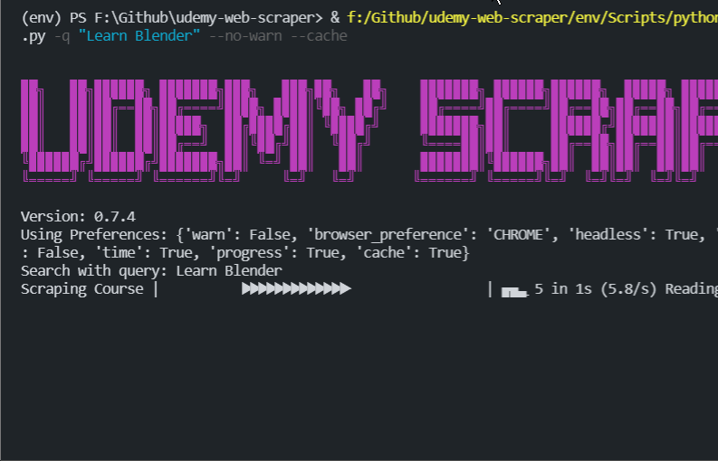
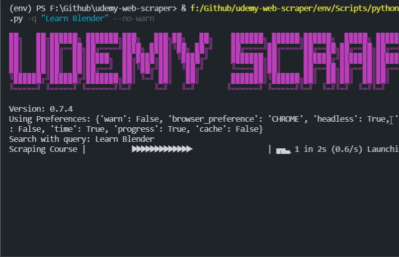

# Changelog

All notable changes to udemyscraper will be documented in this file.

The format is based on [Keep a Changelog](https://keepachangelog.com/en/1.0.0/),
and this project adheres to [Semantic Versioning](https://semver.org/spec/v2.0.0.html).

## [Beta 0.8.0] - 2021-08-29

### Added
-  #### **Udemyscraper** can now export multiple courses to csv files!
  - `course_to_csv` takes an array as an input and dumps each course to a single csv file.
-  #### **Udemyscraper** can now export courses to xml files!
  - `course_to_xml` is function that can be used to export the course object to an xml file with the appropriate tags and format.
- `udemyscraper.export` submodule for exporting scraped course.
- Support for Microsoft Edge (Chromium Based) browser.
- Support for Brave Browser.

### Changes
- #### **Udemyscraper.py** has been refractured into 5 different files:
  - `__init__.py` - Contains the code which will run when imported as a library
  - `metadata.py` - Contains metadata of the package such as the name, version, author, etc. Used by setup.py
  - `output.py`   - Contains functions for outputting the course information.
  - `udscraperscript.py` -Is the script file which will run when you want to use udemyscraper as a script.
  - `utils.py` - Contains utility related functions for udemyscraper.
- #### Now using udemyscraper.export instead of udemyscraper.output.
  - `quick_display` function has been replaced with `print_course` function.
  

- #### Now using `setup.py` instead of `setup.cfg`
- #### Deleted `src` folder which is now replaced by `udemyscraper` folder which is the source directory for all the modules
- ### **Installation Process**
  #### Since udemyscraper is now to be used as a package, it is obvious that the installation process has also had major changes.

  Installation process is documented [here](readme.md/#Installation) 
- Renamed the `browser_preference` key in Preferences dictionary to `browser`
- Relocated browser determination to `utils` as `set_browser` function.
- Removed `requirements.txt` and `pyproject.toml`
  
### Fixed
- Fixed cache argument bug.
- Fixed importing preferences bug.
- Fixed Banner Image scraping.
- Fixed Progressbar exception handling.
- Fixed recognition of chrome as a valid browser.
- Preferences will not be printed while using the script.
- Fixed `browser` key error

## [0.7.4] - 2021-08-25

### Added

- Checks if cache files are present in the working directory or not
- If cache files are present and caching is set to enabled, it will use the cached files for scraping
- Added a clear cache argument that will delete the cache files and generate new ones
- Automatically clear cache if query/ course being scraped is different

- | With Cache               | Without Cache               |
  | ------------------------ | --------------------------- |
  |  |  |
  | 3 Seconds                | 17 Seconds                  |

## [0.7.3] - 2021-08-25

### Added

- Udemyscraper now shows a progressbar when active displaying the task being done.
- Disable progressbar when evoked as a module
- Add an argument to enable/disable progressbar
- Progress check sections and modules
- Disable Progressbar when quiet mode is on.

## [0.7.2] - 2021-08-23

### Added

- Logging levels - debug and info

## [0.7.1] - 2021-08-16

### Added

-  Added another key to the options dictionary for debug level.

### Changed

- Now Displays all the debug messages of both selenium's web driver and the script
- Increased timeout limit for page load
- Removed some redundant code and fixed typos

[0.7.4]: https://github.com/sortedcord/udemy-web-scraper/pull/32
[0.7.3]: https://github.com/sortedcord/udemy-web-scraper/pull/29
[0.7.2]: https://github.com/sortedcord/udemy-web-scraper
[0.7.1]: https://github.com/sortedcord/udemy-web-scraper
